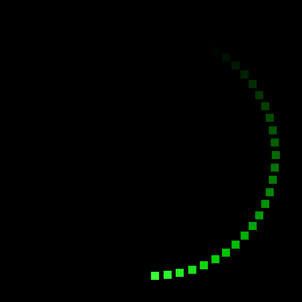

# Generative Art in Rust
This is a framework project for creating Generative Art in Rust, making it very easy to
create Gifs and MP4 videos from simple algorithms. There is a 
[You Tube](https://www.youtube.com/playlist?list=PLFOS-Gn3aXRMY45bqBNT8elRRsJ2gfKm2) 
series to go along with this project.

## YouTube series
We are running a series of examples and tutorials on YouTube to show how this project works,
as well as hoping to inspire you to make your own creations. 

The series can be found [here](https://www.youtube.com/playlist?list=PLFOS-Gn3aXRMY45bqBNT8elRRsJ2gfKm2)

## To run locally
`cargo run` - outputs to the `outputs` folder

## To run in docker
`./run_build.sh` - outputs to the `data/outputs` folder

## Adding Code
You can add code in `user.rs`. There are two stages, the `setup` phase where you can create 
objects that are moved every frame, and the `render` stage which is called for every frame,
passing in the fraction through the whole process. This has been updated since the original videos
were released so some examples may differ. 

If you look in `user.rs` you will see two functions `get_initial_state()` and `render_frame()`. Add
code to be run during setup in the function `get_initial_state()` and anything that is needed to actually
render each frame inside `render_frame()`.

### Example code
Below is an example of a green square which will rotate around and leave a trail

```rust
// Constants at the top main.rs
const WIDTH: u32 = 600;
const HEIGHT: u32 = 600;
const FRAMES: u32 = 60;
const REPETITIONS: u32 = 3;
const SIZE: u32 = 16;
const DECAY: u32 = 10;
```

And inside `user.rs` and specifically in the function `render_frame()`:

```rust
...snip

        // Perform caluclation of current frame state
        let frame_fraction = frame as f32 / FRAMES as f32;
        print!("\rRendering Frames: {:.2}%", frame_fraction * 50.0);
        
        let fraction_radian = frame_fraction * (std::f32::consts::PI * 2.0);
        let half_width: f32 = WIDTH as f32/2.0;
        let offset_x =  (WIDTH as i32/2) + (fraction_radian.sin() * (half_width * 0.8)) as i32;
        let half_height: f32 = HEIGHT as f32/2.0 ;
        let offset_y: i32 = (HEIGHT as i32/2) - (fraction_radian.cos() * (half_height * 0.8)) as i32;
        
        // Draws the square
        for x in 0..SIZE {
            for y in 0..SIZE {
                let x_pos = x + offset_x as u32;
                let y_pos = y + offset_y as u32;

                if x_pos > 0 && x_pos < WIDTH && y_pos > 0 && y_pos < HEIGHT {
                    image.put_pixel(x_pos, y_pos, Rgb([55, 255, 55]));
                }
            
            }
        }
        // End frame generation

```

which should produce the following output:



### Accessing example code

A list of examples can be found on the [Examples Page](docs/examples.md)
