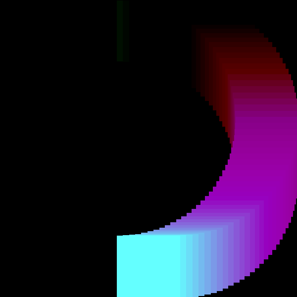

# List of example projects and their branches

### Green Square Moving in a Circle

A green square which moves in a clockwise direction and leaves a trail.
The code can be found on the branch `example/green-clockwise`

 
More information available [here](green-cycle-clockwise.md).

### Rotating Color Wheel

A rotating wheel of color which changes as time goes by. The code 
is available on `example/color-changing-wheel`.

More information available [here](rotating-color-wheel.md).