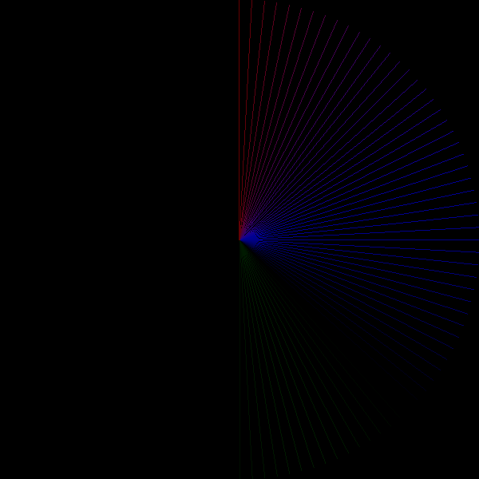

# List of example projects and their branches

### Green Square Moving in a Circle

A green square which moves in a clockwise direction and leaves a trail.
The code can be found on the branch `example/green-clockwise`

More information available [here](green-cycle-clockwise.md).

### Rotating Color Wheel

A rotating wheel of color which changes as time goes by. The code 
is available on `example/color-changing-wheel`.

More information available [here](rotating-color-wheel.md).

### Figure of 8

A rotating wheel of color which changes as time goes by. The code 
is available on `example/figure_of_8`.

More information available [here](figure-of-8.md).

### Color wheel (using imageproc)

A wheel of color, using lines drawn from the center, using the imageproc
library. It is available on `example/imageproc-drawing`

More information available [here](imageproc-drawing.md).