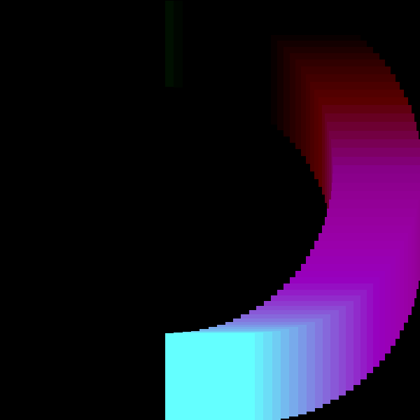

# Rotating Color Wheel



This can be produced with the following code (also available on the the branch `example/color-changing-wheel`):

```rust
const WIDTH: u32 = 600;
const HEIGHT: u32 = 600;
const FRAMES: u32 = 120;
const REPETITIONS: u32 = 10;
const SIZE: u32 = 128;
const DECAY: u32 = 4;

...snip

        // Perform caluclation of current frame state
        let frame_fraction = frame as f32 / FRAMES as f32;
        print!("\rRendering Frames: {:.2}%", frame_fraction * 50.0);
        
        let fraction_radian = frame_fraction * (std::f32::consts::PI * 2.0);
        let half_width: f32 = WIDTH as f32/2.0;
        let offset_x =  (WIDTH as i32/2) + (fraction_radian.sin() * (half_width * 0.8)) as i32;
        let half_height: f32 = HEIGHT as f32/2.0 ;
        let offset_y: i32 = (HEIGHT as i32/2) - (fraction_radian.cos() * (half_height * 0.8)) as i32;
        let red:u8 = 100 + (fraction_radian.sin() * 155.0) as u8;
        let green: u8 = 255 -(fraction_radian.sin() * 255.0) as u8 ;
        let blue: u8 = 255 - (fraction_radian.cos() * 255.0) as u8; 

        for x in 0..SIZE {
            for y in 0..SIZE {
                let half_size = SIZE as i32/2;
                let x_pos = (x as i32 + offset_x) - half_size;
                let y_pos = (y as i32 + offset_y) - half_size;

                if x_pos > 0 && x_pos < WIDTH as i32 && y_pos > 0 && y_pos < HEIGHT as i32 {
                    image.put_pixel(x_pos as u32, y_pos as u32, Rgb([red, green, blue]));
                }
            
            }
        }
        // End frame generation

```